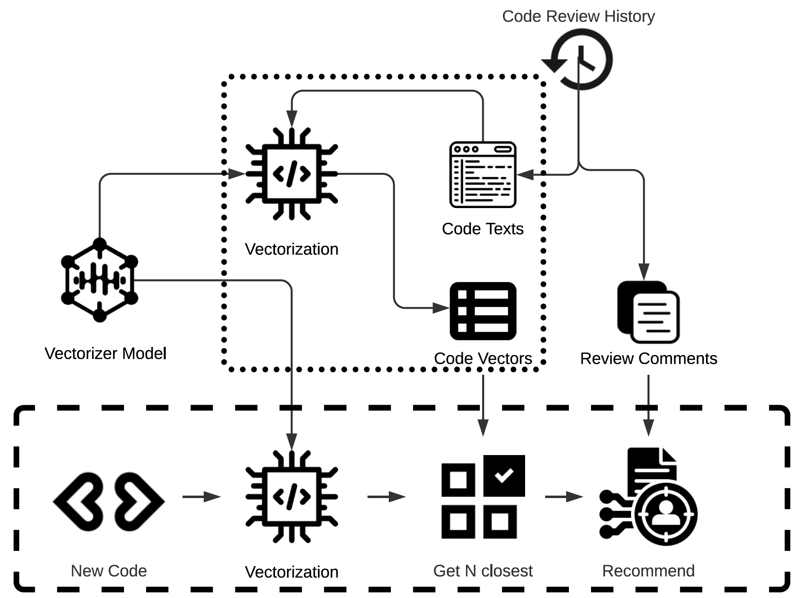
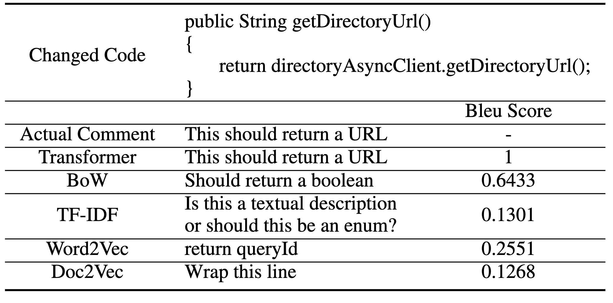
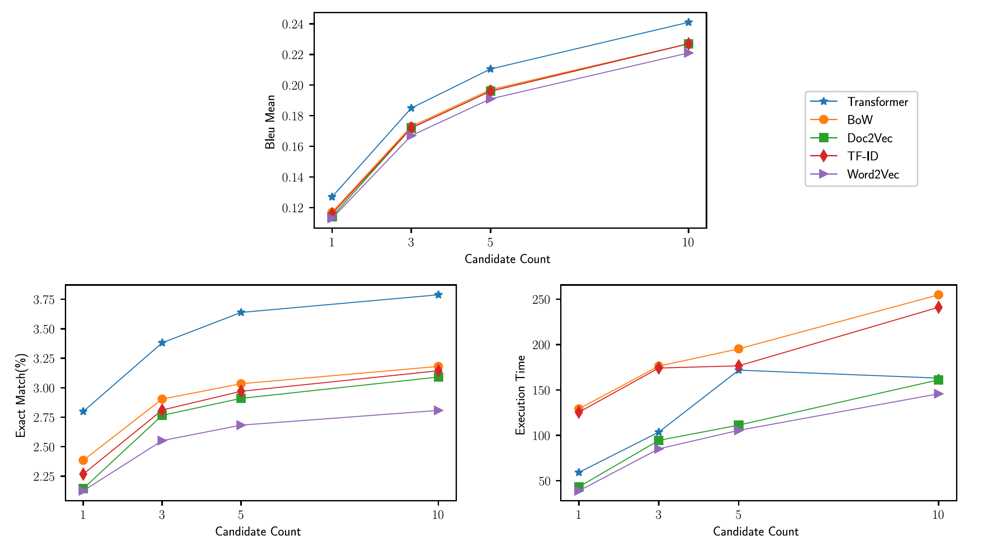
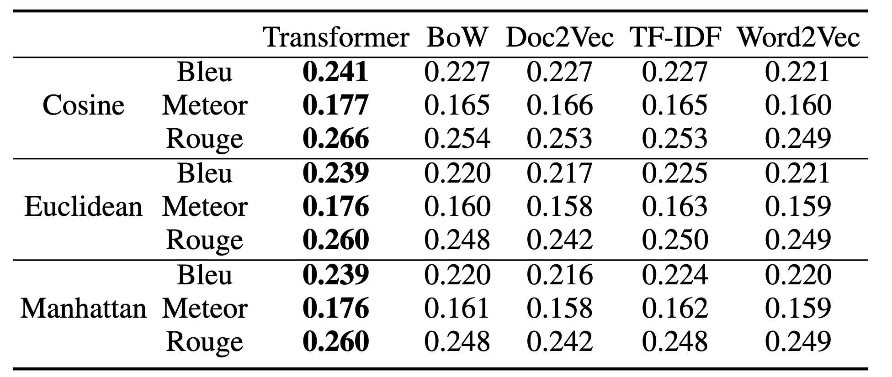

# Automating Modern Code Review Processes with Code Similarity Measurement

This repository contains research code for the paper ["Automating Modern Code Review Processes with Code Similarity Measurement"](http://dx.doi.org/10.2139/ssrn.4450324). Our research aims to automating code review processes by measuring code similarity.

Data and models available at [Mega.nz](https://mega.nz/folder/kv4GDDJa#pcgag7752nVLPumSilU_yg).

## Architecture

</img>

## Auxiliary Libraries

In `libs` directory, you can find auxiliary libraries that we used in our experiments.

1. **Vectorizers:** TF-IDF, Bag-of-Words, Word2Vec, Doc2Vec, Transformers
2. **Metrics:** Text similarity, vector distance.

## Evaluation

`experiment.py` contains necessary codes to reproduce the experiments in the paper.
You can find example usage in `experiment_runner.ipynb`.

## Example

</img>

## Results

</img>

## Citation

If you use this repository for your work, please don't forget to give proper credit by including the accompanying [paper](https://dx.doi.org/10.2139/ssrn.4450324) in your references.

@article{KARTAL2024107490,
    title = {Automating modern code review processes with code similarity measurement},
    journal = {Information and Software Technology},
    pages = {107490},
    year = {2024},
    issn = {0950-5849},
    doi = {https://doi.org/10.1016/j.infsof.2024.107490},
    url = {https://www.sciencedirect.com/science/article/pii/S0950584924000958},
    author = {Yusuf Kartal and E. Kaan Akdeniz and Kemal Özkan},
    keywords = {Modern code review, Vectorization, Code similarity, Information retrieval}  
}
